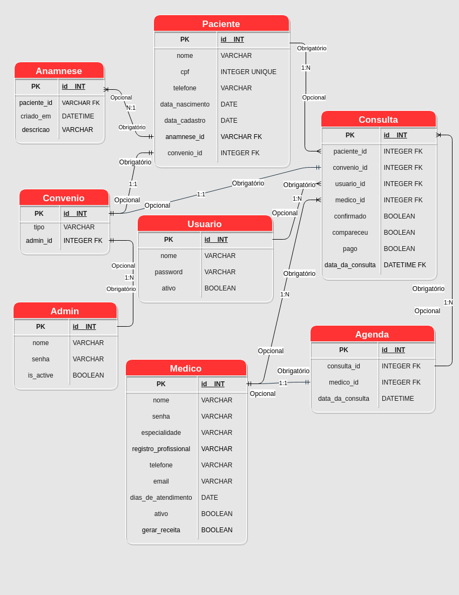

# Capstone-M5

Para iniciar o projeto após clonar repositório

python -m venv venv
source venv/bin/activate
pip install -r requirements.txt
pip freeze > requirements.txt

Para conectar com o postgres, primeiro crie o .env de acordo com o .env.example, e coloque os valores indicados e o nome do banco de dados db_clinica, e crie o banco no seu postgres
CREATE DATABASE db_clinica;
depois...

./manage.py makemigrations
./manage.py migrate



## Pitch

A ideia do projeto é desenvolver um sistema para um ambiente de uma clínica na área de saúde, mais especificamente para prestadores de serviço, que poderá ser utilizado em diversas áreas à compreender à logística de atendimento.
Será estruturado um ambiente onde muitos médicos possuem cada um uma respectiva agenda que é controlada por um atendente e, além disso, o cadastro e controle das sessões de cada paciente também será executado
pelo mesmo. Para além disso, os pacientes podem ser integrantes ou não de algum convênio específico que deverá ser especificado quando solicitado.<br>
A motivação surgiu após conversarmos entre os integrantes do grupo e observarmos que esse é um problema comum em vários ambientes com um grande número de pacientes que necessitam de um controle eficaz.
Dessa maneira, o problema a ser resolvido constitui-se na criação de um software com várias tabelas que irão se relacionar entre si de maneira eficiente com o objetivo de controlar de forma adequada todo o fluxo de atendimento desde o agendamento e evitando aborrecimentos e complicações desnecessárias tanto por parte dos colaboradores, quando por parte dos clientes.
Para o projeto, iremos utilizar ferramentas como Python, Django e Django Rest Framework para criar as tabelas e relações, os bancos de dados serão criados a partir do postgresSQL. Implementaremos também um sistema de validação de acessos de usuários comuns e Administradores com uso de tokens através do JWT.


Descrição da aplicação:
O usuário Administrador/Gerente (Admin) da Clínica tem acesso a todas as rotas, é permitido inserir ou deletar dados em qualquer tabela, assim como terá a possibilidade de realizar buscas e filtros em todas as tabelas.
O atendente (usuario) tem acesso a criar paciente, tendo em seus campos obrigatórios a limitação de somente escolher algumas opções de tipo de convênio, somente aqueles que foram criados pela Administração da Clínica e não dos convênio vindos de banco de dados externos, pode criar consultas e alterar (atualizar) os dados dessa consulta, o campo data da consulta é relativo ao campo de data de consulta da tabela agenda previamente habilitado pela Administração, em feature futura poderá criar receitas derivadas de seu atendimento.
O médico/profissional que realizará atendimento ou procedimento na Clínica, terá acesso somente à sua agenda, poderá inserir informações na tabela anamnese do paciente que passar por sua consulta, em feature futura poderá criar receitas derivadas de seu atendimento.

## URLS:

## Pacientes:

Admin = Acessa tudo.
Todas rotas precisam de autenticação verificado por token.
A criação de pacientes se reserva em receber os convênios somente criados por Admin da Clínica e não de banco de dados externos
Paginação de 20 itens por visualização

POST
BASE_URL/pacientes
Permissão: Usuário / Admin

POST - BASE_URL/pacientes (criar paciente / capturado por token)


```

Request.body = {
"nome":"string",
"cpf":"string",
"telefone":"string",
"data_nascimento":"DATE_FIELD",
"convenio":"string" - Default "particular"
}
```


```
Response = {
id = "read_only",
"nome":"string",
"telefone":"string",
"data_nascimento":"string",
"convenio":"string",
"data_cadastro":"DATETIME.NOW",
}
```


Status: 201

GET POR ID
BASE_URL/pacientes/<paciente_id> (capturar paciente por id)
Permissão: Usuário / Admin / Médico


```
Response = {
id = "read_only",
"nome":"string",
"telefone":"string",
"data_nascimento":"string",
"convenio":"string",
"data_cadastro":"DATETIME.NOW",
}
```

Status: 200

Permissão: Usuário / Admin

GET
BASE_URL/pacientes (listar todos pacientes)
Permissão: Usuário / Admin / Médico


```
Response = [{
res.body = [{
id = "read_only",
"nome":"string",
"telefone":"string",
"data_nascimento":"string",
"convenio":"string",
"data_cadastro":"DATETIME.NOW",
},...]

```

Status: 200

Permissão: Atendente / Admin / Médico

PATCH - BASE_URL/pacientes/<paciente_id> (atualizar paciente)

Permissão: Atendente / Admin

```
Req.body = {

"nome":"string",
"cpf":"string",
"telefone":"string",
"data_nascimento":"DATE_FIELD",
"convenio":"string" - Default "particular"
"atualizado_em":"DATETIME.NOW()",
}
```
OBS: Não pode alterar data de cadastro.

Status: 200

DELETE
BASE_URL/pacientes/<paciente_id> (deletar paciente com o id)
Permissão: Admin
```
req.body = {}
```
Status: 204

## Consultas:

POST - BASE_URL/consultas/<paciente_id> - criar consulta
Permissão: Usuário / Admin

PS: capturar user id pelo token do usuario id


```
Req.body = {
"paciente_id":"string",
"convenio_id":"string",
"medico_id":"string",
"usuario_id":"string", - capturar pelo token
"confirmado":"BOOLEAN", - default False
"compareceu":"BOOLEAN", - default False
"pago":"BOOLEAN", - default False
"data_da_consulta":"DATETIMEFIELD",
}
```

Status: 201
```

res.body = {
"paciente_id":"string",
"convenio_id":"string",
"medico_id":"string",
"data_da_consulta":"serializer que busca na agenda a data da consulta",
}
```
OBS: Fazer futuramente o response ter a data da consulta

PATCH
BASE_URL/consultas/<id>
Permissão: Usuário / Admin

```
req.body = {
"paciente_id":"string",
"convenio_id":"string",
"medico_id":"string",
"confirmado":"BOOLEAN", - default False
"compareceu":"BOOLEAN", - default False
"pago":"BOOLEAN", - default False
"data_da_consulta":"DATETIMEFIELD",
}
```

```
res.body = {retornar toda a consulta atualizada}
```

status: 200

DELETE
BASE_URL/consultas/<id>

permissões = ADMIN, Usuário
```

req.body = {}
```

status: 204

GET
BASE_URL/consultas
permissões = Admin, Usuário

```
req.body = {}
```

```
res.body = [{
"id":"string",
"paciente_id":"string",
"convenio_id":"string",
"medico_id":"string",
"confirmado":"BOOLEAN", - default False
"compareceu":"BOOLEAN", - default False
"pago":"BOOLEAN", - default False
"data_da_consulta":"DATETIMEFIELD",
},...]
```

status: 200

GET POR ID
BASE_URL/consultas/<id>
permissões = Admin, Usuário

```
req.body = {}
```

```
res.body = {
"id":"string",
"paciente_id":"string",
"convenio_id":"string",
"medico_id":"string",
"confirmado":"BOOLEAN", - default False
"compareceu":"BOOLEAN", - default False
"pago":"BOOLEAN", - default False
"data_da_consulta":"DATETIMEFIELD",
}
```


status: 200

## Convênio

Verificar via token se usuário é Admin

GET:
BASE_URL/convenios
permissões = Admin, Usuário

req.body = {}


```
Res.body = {
"id":"string",
"tipo":"string"
}
```


Status: 200

POST:
BASE_URL/convenios
permissões = Admin


```
Req.body = {

"tipo":"string"
}
```


```
Res.body = {
"tipo":"string",
"Admin":"string",
}
```


status 201

PATCH:
BASE_URL/convenios/<id>
permissões = Admin


```
Req.body{

"tipo":"string"
}
```


```
Res.body = {
"admin": {Serializer com dados não sensíveis}
}
```


status: 200

DELETE:
BASE_URL/convenios/delete/<id>
permissões = Admin


```
Req.body = {}
```


status: 204

## Médicos

Acesso interno da clínica (Admin, funcionário), precisa estar autenticado.
GET:
BASE_URL/medicos
permissões: Admin, Usuário


```
Req.body = {}
```

```
Res.body = [{

"id":"string",
"nome":"string",
"especialidade":"string",
"telefone":"string",
"email":"string",
"dia_de_atendimento": SERIALIZER DA AGENDA DO MÉDICO,
"ativo":"BOOLEAN",
"registro_profissional":"string",
},...]
```

Status: 200

GET POR ID
BASE_URL/medicos/<id>
permissões: Admin, Usuário


req.body = {}

```
res.body = {
"id":"string",
"nome":"string",
"especialidade":"string",
"telefone":"string",
"email":"string",
"dia_de_atendimento": SERIALIZER DA AGENDA DO MÉDICO,
"ativo":"BOOLEAN",
"registro_profissional":"string",
}

```


Status: 200

POST:
Permissões: Admin


```
Req.body = {
"nome":"string",
"email":"string",
"senha":"string",
"registro_profissional":"string",
"dias_de_atendimento":"SERIALIZER DE AGENDA VAZIA",
"especialidade":"string",
}
```


```
Res.body =
{
"id":"string",
"nome":"string",
"email":"string",
"registro_profissional":"string",
"dias_de_atendimento":"SERIALIZER DE AGENDA VAZIA",
"especialidade":"string",
}
```

Status: 201

DELETE:
Permissões: Admin
BASE_URL/medicos/delete/<id>

status: 204

PATCH:
Permissões: Admin


```
Req.body = {
"nome":"string",
"email":"string",
"senha":"string",
"registro_profissional":"string",
"dias_de_atendimento":"SERIALIZER DE AGENDA VAZIA",
"especialidade":"string",
}
```


```
Res.body = {Voltar usuário atualizado com dados não sensíveis}
```


status: 200

## Rota de usuários

GET - Listar todos usuários
permissões = Admin
BASE_URL/usuarios

Req.body = {}
```
Res.body = [{

"id":"string",
"nome":"string",
"email":"string",
"senha":"string",
"ativo":"BOOLEAN",
},...]
```

status: 200

GET POR ID
BASE_URL/usuarios/<id>
permissões = Admin


```
Res.body = {

"id":"string",
"email":"string",
"nome":"string",
"ativo":"BOOLEAN",
}
```

status: 200

DELETE
BASE_URL/usuarios/<id>
permissões = Admin

status: 204

POST
BASE_URL/usuarios
permissões = Admin


```
Req.body = {

"nome":"string",
"email":"string",
"senha":"string",
}
```


```
Res.body = {
retorna usuário sem dados sensíveis
}
```

status: 201

UPDATE
BASE_URL/usuarios/<id>
permissões = Admin


```
Req.body = {
"email":"string",
"nome":"string",
"senha":"string",
"ativo":"BOOLEAN",
}
```


```
Res.body = {"Usuário atualizado"}
```


status: 201

## AGENDA - Médico só consulta a própria agenda verificado por token

GET
BASE_URL/agendas
Permissões: Admin, Usuário

req.body = {}

```
res.body = [{
"id":"string",
"consulta_id":"string",
"medico_id":""string,
"data_consulta":"DATETIMEFIELD",
},...]
```

status: 200

GET POR ID
BASE_URL/agendas/<id>
Permissões: Admin, Usuário, Médico

```
res.body = {
"id":"string",
"consulta_id":"string",
"medico_id":""string,
"data_consulta":"DATETIMEFIELD",
}
```

DELETE
BASE_URL/agendas/<id>
Permissões: Admin, Usuário

req.body = {}

status: 204

POST
BASE_URL/agendas
Permissões: Admin, Usuário


```
req.body = {
"consulta_id":"string",
"medico_id":""string,
"data_consulta":"DATETIMEFIELD",
}
```

```
res.body = {
"id":"string",
"consulta_id":"string",
"medico_id":""string,
"data_consulta":"DATETIMEFIELD",
}
```

status: 201

PATCH
BASE_URL/agendas/<id>
Permissões: Admin, Usuário


Permissões: ADMIN, Usuário


```
req.body =  {
"consulta_id":"string",
"medico_id":""string,
"data_consulta":"DATETIMEFIELD",
}
```

res.body = {
"consulta_id":"string",
"medico_id":""string,
"data_consulta":"DATETIMEFIELD",
}

status: 200
